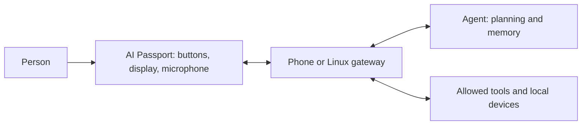

[简体中文](personal-agent-ecosystem.zh_CN.md) · **English**

# Personal agent ecosystem: design proposal

This page is an engineering hypothesis, not a vendor roadmap or a tested feature. Reviewed 2026-10-03; it builds on the linked [Muse research](muse-gadgets.md) and [board capabilities](../capabilities.md).

A durable personal agent needs identity, preferences, memory and authorized tools. Small hardware can provide a convenient physical interface while a phone, PC or cloud service handles semantic work. Linux gateways can expose local capabilities; ESP32 endpoints can collect deliberate input, show progress and play short feedback.

The useful ecosystem boundary is a capability contract: device identity, available operations, resource limits, connection health, action request IDs and execution acknowledgements. A skill explains when to use a capability; it does not itself grant OS permissions. Interoperability must be implemented and tested rather than inferred from the word "agent". No Muse/MCP/A2A compatibility is claimed here.

For this board, start with a task companion: display queued/running/failed states, short text summaries and a single scoped confirmation action. Keep vocabulary and Tetris available offline. A later audio lesson could request one sentence, record a short response and offload assessment. BLE multiplayer can share compact quiz/game state without requiring a large model.

Evaluate success with measurable budgets: idle current and ten-minute workload energy, reconnect latency, minimum free heap during TLS/audio, response time, replay-safe request IDs, offline behavior and deletion of personal data. Distinguish pressing a button to acknowledge a task from granting unrestricted computer control.

An open ecosystem benefits from interchangeable services and local fallback. Token-dependent vendor access can accelerate prototypes but adds account availability, revocation and distribution dependencies. The board's value is portability and low-friction interaction; memory-heavy inference and unrestricted execution are gateway responsibilities in this proposal.

Roadmap: (1) mock status companion, (2) one allowed local action with an acknowledgement, (3) audio practice, (4) optional vendor adapters. Each stage needs host protocol checks and physical acceptance. None has been implemented by this publication.
