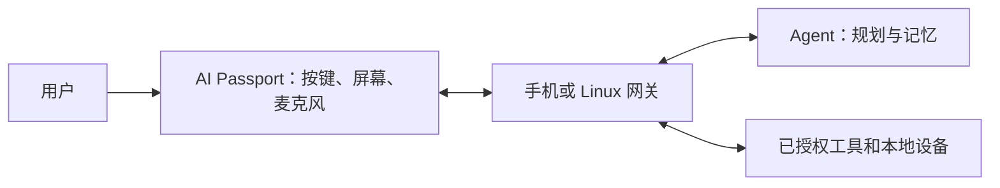

[English](personal-agent-ecosystem.md) · **简体中文**

# Personal agent 生态：设计思考

本页是工程推测，不是厂商路线图，也不是已实现功能。日期：2026-10-03；依据 [Muse 调研](muse-gadgets.zh_CN.md)与[设备能力](../capabilities.zh_CN.md)。

长期 personal agent 需要身份、偏好、记忆与获准使用的工具。小硬件提供方便的实体入口，手机、电脑或云端处理语义任务；Linux 网关暴露本地能力；ESP32 终端负责明确输入、状态展示和简短反馈。

生态真正需要约定的是能力契约：设备身份、可执行操作、资源限制、连接状态、动作请求编号与执行回执。skill 描述如何使用能力，本身不授予系统权限。互通需要协议实现和验证，不能从 agent 这个名称推导。本项目没有声称兼容 Muse/MCP/A2A。

适合该设备的起点是任务伴侣：展示排队、运行、失败状态，短文字摘要，以及一个限定范围的按键确认动作。词汇与俄罗斯方块保留离线可用。后续听说练习可以请求一句例句、录制短回答，把评估交给外部服务；BLE 联机共享精简答题或游戏状态，无需大模型。

验收指标应包括待机电流和十分钟负载耗电、重连延迟、TLS/音频时最低剩余堆、响应时间、防止重复执行的请求编号、离线行为、个人数据删除。确认某个任务和开放整台电脑的控制权是不同的权限范围。

可替换服务和本地回退有利于开放生态。厂商 token 能加速原型，但引入账号可用性、撤销和分发条件。该板的优势是便携与简单交互；本方案把内存密集推理和复杂执行放在网关。

路线：①模拟状态伴侣；②一个获准本地动作及回执；③音频练习；④可选厂商适配器。各阶段均需协议测试和实体设备验收。本次发布没有实现这些扩展。
